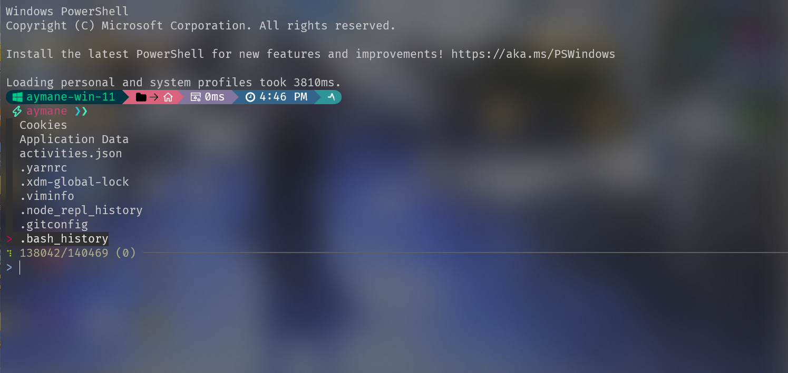
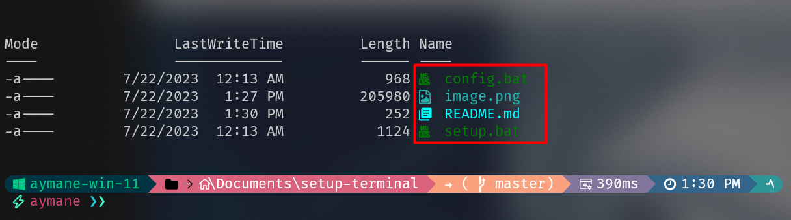
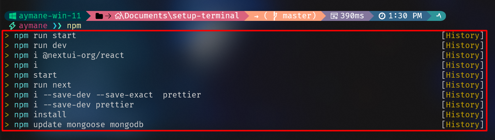
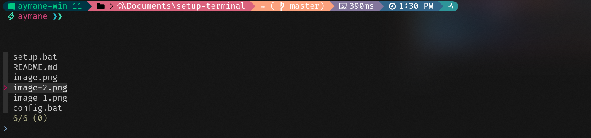
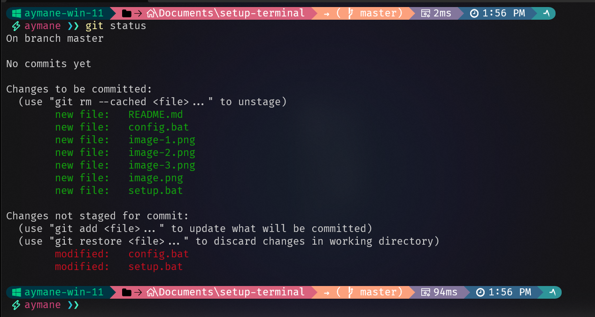
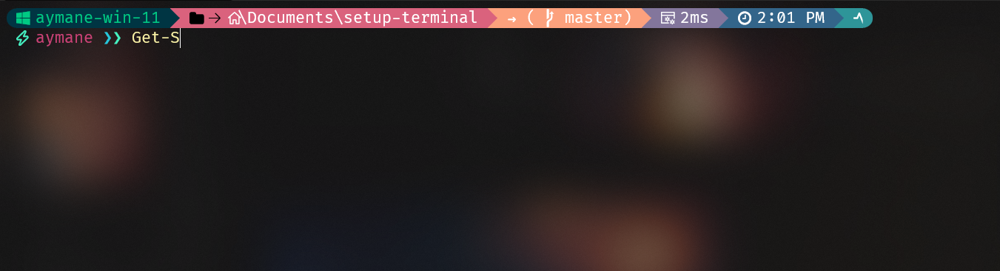

# my terminal setup:

## first setp:

launch `iwr_install.ps1` to install all the packages and wait for it to finish

## second step:

launch `installer.py` or `dist\installer.exe` with admin privileges to configure the terminal and wait for it to finish.

## third step:

launch `setup.bat` to configure the terminal and wait for it to finish.

## fourth step:

launch `install_dependencies.ps1` to install all the dependencies and wait for it to finish

## fifth step:

launch `config.bat` to configure the terminal and wait for it to finish.

# features:

### terminal icons :

### commands history :

### file finder :

you can use `ctrl + f` to search for files and `ctrl + r` to search for commands

### imporve git experience :

git commands auto completion `git ch` will be completed to `git checkout` and so on <strong> make sure to click Tab </strong>

### powershell auto completion :

powershell commands auto completion `Get-` will be completed to `Get-Command` and so on <strong> make sure to click Tab </strong>

# enjoy

# Contributing

If someone wants to add or improve something, I invite you to collaborate directly in this repository: [terminal-setup](https://github.com/aymaneallaoui/setup-terminal)
