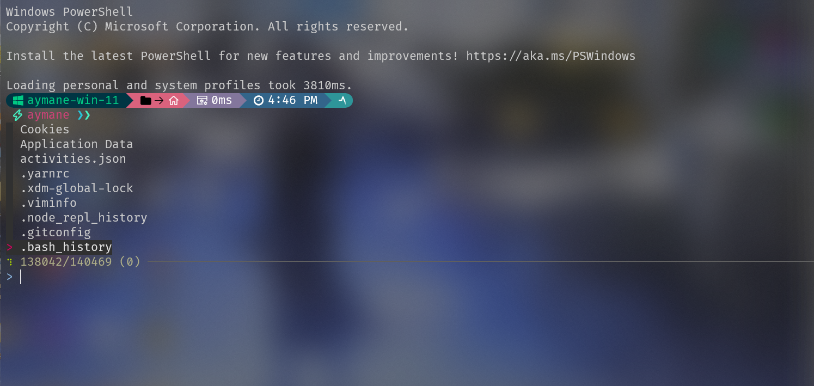
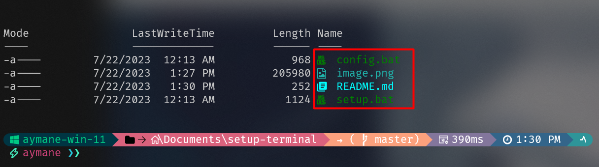
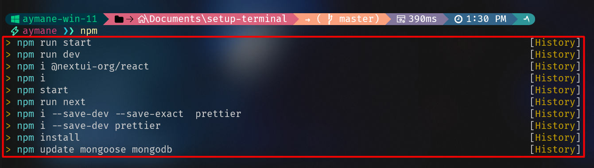
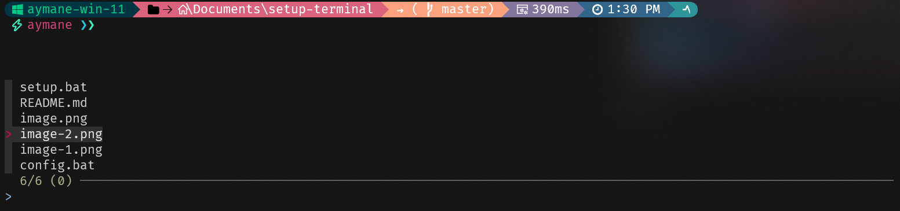
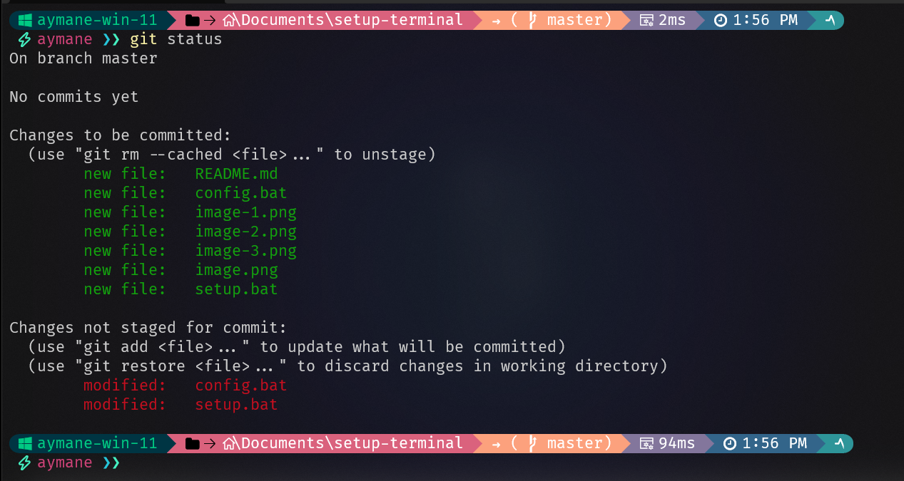
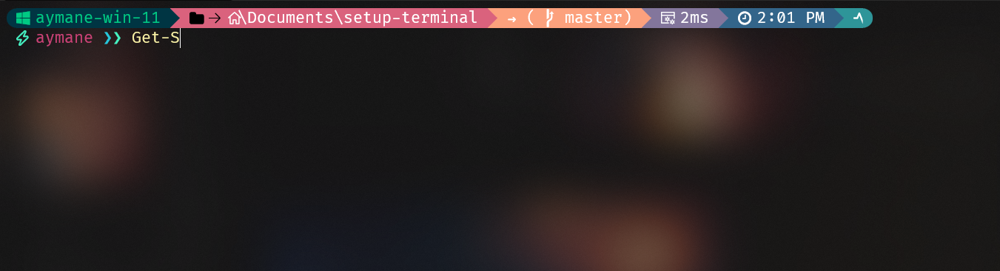

# Universal Terminal Setup 🚀



A **one-run script** that automatically sets up a beautiful and powerful terminal environment for both **Windows PowerShell** and **Linux/WSL**!

## ✨ What's New

- 🎯 **One-click setup** - No more 5 manual steps!
- 🔄 **Cross-platform** - Works on Windows, Linux, WSL, and macOS
- 🤖 **Smart detection** - Automatically detects your environment
- ⚡ **Modern tools** - Uses the latest terminal enhancements

## 🚀 Quick Start

### One-Line Installation

```bash
# Download and run the setup script
curl -fsSL https://raw.githubusercontent.com/aymaneallaoui/setup-terminal/master/setup.sh | bash
```

Or download and run manually:

```bash
# Clone the repository
git clone https://github.com/aymaneallaoui/setup-terminal.git
cd setup-terminal

# Make the script executable and run it
chmod +x setup.sh
./setup.sh
```

### Windows PowerShell Alternative

If you're on Windows and prefer PowerShell:

```powershell
# Run directly in PowerShell
iwr -useb https://raw.githubusercontent.com/aymaneallaoui/setup-terminal/master/setup.ps1 | iex
```

### Command-Line Options (Linux / WSL / macOS)

`setup.sh` is safe to re-run and accepts a few flags:

```bash
./setup.sh                 # full setup, auto-detect (installs & uses zsh)
./setup.sh --shell bash    # configure bash only, don't install zsh
./setup.sh --no-chsh -y    # set up zsh but keep your current default shell
./setup.sh --no-install    # just (re)write configs for already-installed tools
./setup.sh --dry-run       # preview every action without changing anything
./setup.sh --help          # full list of options
```

| Flag | Description |
|------|-------------|
| `--shell <auto\|zsh\|bash>` | Which shell to configure (default `auto` → zsh) |
| `--no-chsh` | Don't change your default login shell |
| `--no-install` | Configure only; skip installing packages/tools |
| `-y`, `--yes`, `--unattended` | Don't prompt; assume yes |
| `-n`, `--dry-run` | Show what would happen, make no changes |
| `-h`, `--help` | Show help |

> Re-running never duplicates anything: all settings live in
> `~/.config/terminal-setup/` and are wired into your rc files via a single
> managed block. Your original `~/.bashrc` / `~/.zshrc` is backed up once to
> `*.uts-backup`.

## 🎨 Features

### 🖼️ Beautiful Terminal Icons


### 📜 Enhanced Command History


### 🔍 Fuzzy File Finder
Use `Ctrl + F` to search for files and `Ctrl + R` to search command history


### 🔧 Improved Git Experience


Git commands auto-completion: `git ch` + `Tab` → `git checkout`

### ⚡ PowerShell Auto-Completion


PowerShell commands auto-completion: `Get-` + `Tab` → `Get-Command`

## 🛠️ What Gets Installed

### For Linux / WSL / macOS:
- **Starship** - the single, fast prompt for both Bash and Zsh. Ships a Nerd-Font-free `starship.toml` so it renders cleanly even on a default WSL terminal.
- **fzf** - fuzzy finder (Ctrl+R history, Ctrl+T / Ctrl+F files). Key bindings are wired up reliably, even on slim/Docker/imported-WSL images that strip the packaged integration files.
- **Zsh + Oh My Zsh** with plugins:
  - zsh-autosuggestions
  - zsh-syntax-highlighting
  - zsh-history-substring-search
- **Bash** is always configured too (same prompt, aliases, history and fzf bindings), so things work even if you skip Zsh or `chsh` is unavailable.
- **Git aliases** and sensible shell defaults
- **WSL integration** - clipboard, opening files/URLs in Windows, browser bridging (see [WSL Specific Issues](#wsl-specific-issues))

All settings live in `~/.config/terminal-setup/` and are wired into your rc files through a single managed block, so re-running is safe and never duplicates configuration.

### For Windows PowerShell:
- **Oh My Posh** - Beautiful prompt system
- **Scoop** - Package manager for Windows
- **PowerShell modules**:
  - PSReadLine - Enhanced command line editing
  - Terminal-Icons - File and folder icons
  - Posh-Git - Git integration
  - PSFzf - Fuzzy finder integration
- **fzf** - File and history search
- **Git aliases** and auto-completion

## 🎛️ Key Bindings

| Shortcut | Function |
|----------|----------|
| `Ctrl + R` | Fuzzy-search command history |
| `Ctrl + T` | Fuzzy-find files into the command line |
| `Ctrl + F` | Fuzzy-find files (same as Ctrl + T) |
| `Tab` | Auto-complete commands/paths |
| `↑/↓` | History substring search (Zsh) |

## 📋 Git Aliases

The setup includes these helpful git aliases:

```bash
gs    # git status
ga    # git add
gc    # git commit
gp    # git push
gpl   # git pull
gl    # git log --oneline --graph --decorate
gd    # git diff
gb    # git branch
gco   # git checkout
gst   # git stash
```

## 🔧 Customization

### Changing the Prompt (Linux / WSL / macOS)

The prompt is **Starship**, configured in `~/.config/starship.toml`. The setup
ships a clean, Nerd-Font-free config; tweak it freely or start from a preset:

```bash
# Browse presets at https://starship.rs/presets/
starship preset nerd-font-symbols -o ~/.config/starship.toml   # needs a Nerd Font
starship preset plain-text-symbols -o ~/.config/starship.toml  # ASCII only
```

**For PowerShell:**
```powershell
# Edit your PowerShell profile and change the Oh My Posh theme
oh-my-posh init pwsh --config "path/to/your/theme.omp.json" | Invoke-Expression
```

### Adding Custom Aliases

**Linux / WSL / macOS:**
Put personal tweaks in `~/.config/terminal-setup/local.sh` — it's loaded last by
both Bash and Zsh and is **never** overwritten when you re-run the setup:
```bash
echo "alias myalias='my command'" >> ~/.config/terminal-setup/local.sh
```

**PowerShell:**
Add to your PowerShell profile:
```powershell
Set-Alias myalias 'My-Command'
```

## 🐛 Troubleshooting

### Script Won't Run
Make sure the script is executable:
```bash
chmod +x setup.sh
```

### PowerShell Execution Policy Error
Run this in PowerShell as Administrator:
```powershell
Set-ExecutionPolicy RemoteSigned -Scope CurrentUser
```

### Missing Dependencies
The script automatically installs dependencies, but if you encounter issues:

**Linux/WSL:**
```bash
sudo apt update && sudo apt install curl git build-essential
```

**Windows:**
Install Git and PowerShell from their official websites.

### WSL Specific Issues

The setup detects WSL automatically (and tells WSL1 from WSL2) and adds a few
quality-of-life integrations:

**Clipboard & opening things**

| Command | What it does |
|---------|--------------|
| `pbcopy` | Pipe text to the Windows clipboard (`echo hi \| pbcopy`) |
| `pbpaste` | Print the Windows clipboard (CRLF stripped) |
| `open <path>` / `e [dir]` | Open a file/folder in Windows Explorer |
| `winhome` | `cd` to your Windows user profile (needs `wslu`) |

URLs open in your Windows browser via `wslview` (`$BROWSER`) when `wslu` is
installed (`sudo apt install wslu`).

**Fonts** — the prompt is intentionally Nerd-Font-free, so it works out of the
box. For richer icons, install a Nerd Font and select it in Windows Terminal:
1. Download a Nerd Font (e.g., FiraCode or CaskaydiaCove Nerd Font)
2. Install it in Windows
3. Set it in Windows Terminal → Settings → your distro → Appearance → Font

**Slow tab-completion / `$PATH` pollution** — by default WSL appends the entire
Windows `PATH`, which can make completion sluggish. Disable it by adding this to
`/etc/wsl.conf`, then run `wsl --shutdown` from Windows:
```ini
[interop]
appendWindowsPath = false
```

**Still on WSL1?** WSL2 is faster and more compatible. From an elevated Windows
prompt: `wsl --set-version <distro> 2`.

**CRLF line endings** — if you cloned on Windows and run under WSL, shell scripts
can break with `bad interpreter` errors. This repo ships a `.gitattributes` that
forces LF on `*.sh`, and `setup.sh` self-heals if it detects CRLF in itself. To
fix an already-broken checkout:
```bash
sed -i 's/\r$//' setup.sh
```

## 🆕 Migration from Old Setup

If you were using the old 5-step process:

1. **Backup your current config** (optional):
   ```bash
   cp ~/.zshrc ~/.zshrc.backup
   cp $PROFILE $PROFILE.backup  # PowerShell
   ```

2. **Run the new setup**:
   ```bash
   curl -fsSL https://raw.githubusercontent.com/aymaneallaoui/setup-terminal/master/setup.sh | bash
   ```

3. **Restart your terminal**

The new setup will automatically detect and preserve compatible configurations.

## 🤝 Contributing

Want to improve this setup? Contributions are welcome!

1. Fork the repository
2. Create a feature branch: `git checkout -b feature/amazing-feature`
3. Make your changes
4. Test on different environments
5. Submit a pull request

### Adding Support for New Shells/OS
The script is designed to be extensible. To add support for a new environment:

1. Add detection logic in `detect_environment()`
2. Create a new setup function (e.g., `setup_fish()`)
3. Add the case in the main function
4. Test thoroughly

## 📜 License

This project is open source and available under the MIT License.

## 🙏 Acknowledgments

- Original setup by [aymaneallaoui](https://github.com/aymaneallaoui)
- Enhanced with cross-platform support
- Thanks to the maintainers of:
  - [Oh My Posh](https://ohmyposh.dev/)
  - [Oh My Zsh](https://ohmyz.sh/)
  - [Starship](https://starship.rs/)
  - [fzf](https://github.com/junegunn/fzf)
  - All the PowerShell and Zsh plugin authors

---

## 🎉 Enjoy Your Enhanced Terminal!

After installation, restart your terminal and enjoy:
- ⚡ Faster workflow with fuzzy finding
- 🎨 Beautiful, informative prompts
- 🔧 Powerful git integration
- 📝 Enhanced command editing
- 🚀 Cross-platform consistency

**Star this repo if it helped you! ⭐**